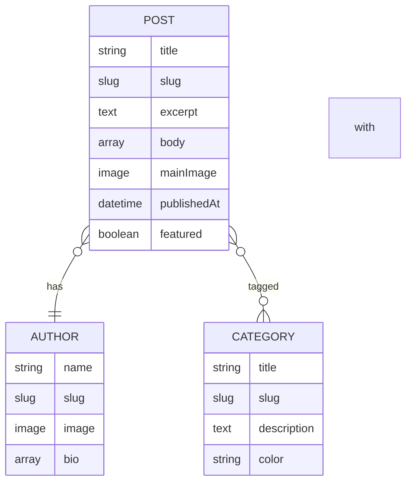
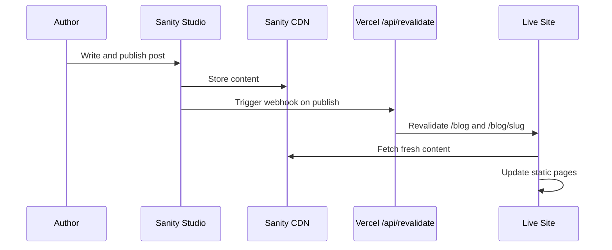

# Sanity CMS Blog Integration Plan

## Overview

Integrate Sanity CMS into the DAOWatch website (deployed on Vercel) to power a self-hosted blog with a weekly publishing cadence. This replaces the current Medium RSS feed approach with a fully integrated content management system.

## Current State

- **Framework**: Next.js 15 with Pages Router
- **UI Library**: Chakra UI v2 + Framer Motion
- **Current Blog**: Fetches posts client-side from Medium via `rss2json` API, links redirect to Medium
- **Deployment**: Vercel (primary) + Arweave (static export)
- **Static Export**: `output: 'export'` in `next.config.js` (needed for Arweave only)

## Architecture

```mermaid
graph TD
    A[Author writes in Sanity Studio at /studio] --> B[Sanity CDN stores content]
    B --> C[Vercel builds with ISR]
    C --> D[Blog listing page /blog]
    C --> E[Individual post /blog/slug]
    B --> F[Sanity Webhook triggers revalidation]
    F --> G[/api/revalidate endpoint]
    G --> C
```

### Key Architectural Decisions

1. **Remove `output: export`** from `next.config.js` — enables ISR on Vercel. The Arweave deployment uses its own Dockerfile and can add the export flag separately.

2. **Stay on Pages Router** — avoids a massive refactor. Use `next-sanity` client directly with `getStaticProps` + ISR.

3. **Self-hosted blog content** — instead of linking to Medium, posts render natively on the site using Portable Text. Major SEO and UX improvement.

4. **Embedded Sanity Studio** — accessible at `/studio` route, authenticated, for content editing.

5. **On-demand revalidation** — Sanity webhook triggers Vercel revalidation when content is published/updated.

## Content Model



### Schema Definitions

**Post** — the main blog article type:
- `title` — string
- `slug` — slug derived from title
- `excerpt` — text, max ~300 chars for card previews
- `mainImage` — image with hotspot and alt text
- `body` — Portable Text array with blocks, images, and code blocks
- `author` — reference to Author
- `categories` — array of references to Category
- `publishedAt` — datetime for scheduling and sorting
- `featured` — boolean for highlighting on homepage

**Author** — person writing the post:
- `name` — string
- `slug` — slug derived from name
- `image` — author photo
- `bio` — Portable Text for rich bio

**Category** — topic tags like DAO, Governance, DeFi:
- `title` — string
- `slug` — slug
- `description` — text
- `color` — string for UI theming

## New File Structure

```
├── sanity.config.ts              # Studio configuration
├── sanity.cli.ts                 # CLI configuration
├── src/
│   ├── sanity/
│   │   ├── client.ts             # Sanity client instance
│   │   ├── queries.ts            # GROQ query helpers
│   │   ├── image.ts              # Image URL builder
│   │   └── schemas/
│   │       ├── index.ts          # Schema exports
│   │       ├── post.ts           # Post schema
│   │       ├── author.ts         # Author schema
│   │       ├── category.ts       # Category schema
│   │       └── blockContent.ts   # Portable Text blocks
│   ├── components/
│   │   ├── PortableText.tsx      # Custom Portable Text renderer
│   │   └── BlogPosts.tsx         # Updated to use Sanity
│   ├── pages/
│   │   ├── blog.tsx              # Updated to use Sanity + ISR
│   │   ├── blog/[slug].tsx       # Updated with Portable Text rendering
│   │   ├── studio/
│   │   │   └── [[...index]].tsx  # Embedded Sanity Studio
│   │   └── api/
│   │       └── revalidate.ts     # Webhook for on-demand ISR
```

## Dependencies to Install

```bash
npm install next-sanity @sanity/image-url @portabletext/react sanity styled-components
```

| Package | Purpose |
|---------|---------|
| `next-sanity` | Sanity toolkit for Next.js — client, Studio embedding |
| `sanity` | Core Sanity Studio for content editing UI |
| `@sanity/image-url` | Build optimized image URLs from Sanity assets |
| `@portabletext/react` | Render Portable Text rich content as React components |
| `styled-components` | Required peer dependency for Sanity Studio |

## Environment Variables

Add to `.env.local` and Vercel project settings:

```env
# Sanity
NEXT_PUBLIC_SANITY_PROJECT_ID=your_project_id
NEXT_PUBLIC_SANITY_DATASET=production
SANITY_API_READ_TOKEN=your_read_token
SANITY_REVALIDATE_SECRET=your_webhook_secret
```

These are provisioned automatically when you connect Sanity via the Vercel integration.

## ISR and Revalidation Strategy



- **Blog listing** (`/blog`): `revalidate: 60` — refreshes every 60 seconds
- **Individual posts** (`/blog/[slug]`): `revalidate: 60` + on-demand via webhook
- **Homepage section**: Revalidated as part of the homepage ISR

## Weekly Publishing Workflow

1. **Write**: Navigate to `daowatch.org/studio`, create a new Post document
2. **Draft**: Fill in title, excerpt, body with rich content, add hero image, select author and categories
3. **Preview**: Review the post in the Sanity preview pane
4. **Publish**: Click Publish — the post goes live on the site within ~60 seconds
5. **Verify**: Check `daowatch.org/blog` for the new post

## Impact on Arweave Deployment

The Arweave deployment currently uses `output: 'export'` in `next.config.js`. Removing it requires:

- **Option A**: Add `output: 'export'` to the Arweave Dockerfile build step via environment variable
- **Option B**: Create a separate `next.config.arweave.js` for Arweave builds
- **Option C**: The Arweave deployment can continue using the existing static build — just needs the export config moved to its build pipeline

The recommended approach is **Option A** — use a conditional in `next.config.js`:

```js
const nextConfig = {
  output: process.env.BUILD_MODE === 'arweave' ? 'export' : undefined,
  // ... rest of config
}
```

Then set `BUILD_MODE=arweave` in the Arweave build environment.

## SEO Improvements

- Blog content is now self-hosted (not linking to Medium)
- Server-rendered HTML at build time with ISR for freshness
- Structured data (JSON-LD) already in place — will be enhanced with Sanity data
- Sanity image CDN provides optimized images with proper alt text
- Slug-based URLs remain the same pattern: `/blog/post-slug`

## Implementation Order

### Phase 1: Sanity Setup
1. Add Sanity integration in Vercel dashboard
2. Install npm dependencies
3. Create schema files (post, author, category, blockContent)
4. Create `sanity.config.ts` and `sanity.cli.ts`
5. Create Sanity client, queries, and image helper

### Phase 2: Studio and Config
6. Embed Sanity Studio at `/studio`
7. Update `next.config.js` (remove export, add Sanity domains)
8. Update `.env.example` with Sanity variables

### Phase 3: Blog Pages
9. Rewrite `src/pages/blog.tsx` to fetch from Sanity with ISR
10. Rewrite `src/pages/blog/[slug].tsx` with Portable Text rendering
11. Update `src/components/BlogPosts.tsx` homepage section
12. Create Portable Text custom renderers matching Chakra UI theme

### Phase 4: Automation
13. Create `/api/revalidate` webhook endpoint
14. Configure Sanity webhook in Vercel

### Phase 5: Content and Testing
15. Migrate existing Medium posts into Sanity
16. Test full workflow: draft → publish → live
